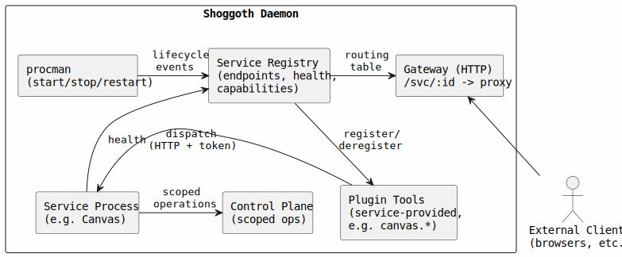

# Web Services Plugin

## Summary

A first-class subsystem for declaring, managing, discovering, and communicating with HTTP/WebSocket services within Shoggoth. Enables agents to expose and consume web-based interfaces (Canvas, dashboards, APIs) through a unified lifecycle. Services can run as in-process plugins, procman-managed processes, or external processes — all producing the same registry entry and tool experience for agents.

## Motivation

Shoggoth currently has no concept of web services. Procman manages process lifecycles, but there's no layer above it that understands "this process serves HTTP on port X" or "agents should be able to call this service." As we port Canvas Web and anticipate future integrations (dashboards, webhook receivers, agent-facing APIs), we need a standard pattern for:

1. Declaring a web service and its contract (port, routes, protocol)
2. Letting procman manage its lifecycle with service-aware health checks
3. Allowing agents to discover and interact with services via tools
4. Optionally exposing services through a shared HTTP gateway with auth
5. Providing a communication bridge between agents and services (bidirectional)

Without this, each web integration becomes a bespoke wiring job. A plugin spec gives us a repeatable pattern and a clear extension point.

## Design

### Architecture Overview



### Service Tiers

Services come in three tiers, each suited to different deployment needs:

| Tier                 | Lifecycle         | Auth                    | Tool Dispatch        | Config                    | Language |
| -------------------- | ----------------- | ----------------------- | -------------------- | ------------------------- | -------- |
| **Plugin service**   | In-process, hooks | Implicit (trusted code) | Direct function call | Self-configuring defaults | JS/TS    |
| **Managed process**  | Procman           | Age-encrypted tokens    | HTTP proxy           | Explicit in `processes[]` | Any      |
| **External process** | External          | Age-encrypted tokens    | HTTP proxy           | Explicit in `services[]`  | Any      |

All three tiers produce the same `ServiceEntry` in the registry. Downstream consumers (gateway, agents, tool system) don't need to know how a service was loaded.

### Key Components

**1. Service Declaration**

**Plugin services** — true Shoggoth plugins using the `hooks-plugin` system. They run in-process in the daemon's Node runtime, register tools directly via the `service.register` hook, and provide their own default configuration. The user only adds a config block to override defaults. Declared in `plugins[]` with `kind: "service"`.

```json
{
  "plugins": [{ "package": "@shoggoth/service-canvas" }]
}
```

The plugin self-configures via the `daemon.configure` waterfall hook. To override defaults, the user adds a matching entry in `services[]`:

```jsonc
{
  "services": [
    {
      "id": "canvas",
      "port": 3200, // override the plugin's default port
    },
  ],
}
```

**Managed services** — declared in `processes[]` with a `service` block. Procman handles the full lifecycle (start, stop, restart, health monitoring).

```jsonc
{
  "processes": [
    {
      "id": "canvas-web",
      "label": "Canvas Web",
      "startPolicy": "boot",
      "command": "node",
      "args": ["dist/server/index.js"],
      "cwd": "/opt/shoggoth-canvas",
      "env": { "PORT": "3100" },
      "restartMode": "on-failure",
      "health": { "kind": "http", "target": "http://localhost:3100/health" },
      "service": {
        "port": 3100,
        "protocol": "http+ws",
        "capabilities": ["canvas", "a2ui"],
        "expose": "gateway",
      },
    },
  ],
}
```

**External services** — declared in a top-level `services[]` block. Shoggoth does not launch or stop these processes, but still performs health checks, auth, tool registration, and gateway routing. Useful for services running in separate containers, on remote hosts, or managed by systemd/Docker/k8s.

```jsonc
{
  "services": [
    {
      "id": "analytics-dashboard",
      "label": "Analytics Dashboard",
      "host": "10.0.1.50",
      "port": 8080,
      "protocol": "http",
      "basePath": "/",
      "capabilities": ["analytics"],
      "expose": "gateway",
      "health": { "kind": "http", "target": "http://10.0.1.50:8080/health" },
    },
  ],
}
```

**2. Service Registry (runtime)**

A singleton that tracks healthy services and their metadata. All three tiers register into the same registry:

- **Plugin services** register themselves directly via the `service.register` hook during `daemon.startup`.
- **Managed services** are registered by procman lifecycle events (process started + health check passed → registered; process stopped → deregistered).
- **External services** are registered via a health check polling loop that registers/deregisters based on reachability.

Provides lookup by ID and by capability.

**3. HTTP Gateway (optional, daemon-managed)**

A lightweight reverse proxy that routes external requests to services. Runs as an in-process HTTP listener. Provides:

- Path-based routing: `GET /svc/canvas-web/...` → `http://localhost:3100/...`
- Auth enforcement: validates Shoggoth-issued tokens before proxying
- CORS and rate limiting at the edge

The gateway is optional — services can also bind directly to host ports for development or single-service deployments. Plugin services that don't listen on a port are not routable through the gateway (their tools are direct function calls).

**4. Tool Registration**

Services provide their own tools rather than going through a generic invoke layer. Tool registration differs by tier:

- **Plugin services** register tools directly via the `service.register` hook. Tools are direct function calls — no HTTP dispatch, no auth tokens. The plugin provides handler implementations inline.
- **Managed/external services** declare tools in their manifest (`GET /manifest` → `tools[]`). On service registration (healthy), the daemon fetches the manifest and registers those tools as HTTP proxy handlers. On deregistration (stopped/failed), tools are removed.

Both dispatch modes produce the same tool interface for agents. Canvas provides `canvas.show`, `canvas.push`, `canvas.eval` etc. as first-class agent tools regardless of which tier it's deployed as.

**5. Auth & Control Plane Access with Operator Approval**

Auth applies to **managed and external services** only. Plugin services are trusted code running in-process and don't need token-based auth.

New managed/external services must be registered and approved by the operator via the CLI before they can communicate with the daemon. During registration, a unique key pair is generated and the operator approves the service's requested control plane scope.

Registration flow:

1. Service is declared in config or operator runs `shoggoth service register <id>`
2. Service starts and serves its manifest (including requested `ops[]`)
3. Daemon fetches manifest and creates a pending registration request
4. Operator runs `shoggoth service requests` to see pending service IDs
5. Operator runs `shoggoth service request <id>` to view full details (requested ops, capabilities, manifest info)
6. Operator runs `shoggoth service approve <id>` to approve
7. On approval, daemon generates an age X25519 identity for the service and stores the recipient (public key, `age1...`) in the daemon's credential store
8. The service's identity (private key, `AGE-SECRET-KEY-1...`) is provided to the service **once** at approval time (displayed by CLI, or written to a file the service can read)
9. The daemon encrypts tokens to the service's recipient; only the service can decrypt them using its identity

This means:

- No shared secrets in environment variables
- Each service has its own age identity — compromise of one service doesn't affect others
- Operator must explicitly review and approve each service and its requested scope before it can interact with the daemon
- Key rotation is per-service via `shoggoth service rotate-key <id>`
- Scope changes require re-approval via `shoggoth service approve <id>`

Token claims (encrypted to the service's recipient):

- `sub`: agent ID
- `scope`: service ID
- `iat` / `exp`: issued/expiry timestamps
- `session`: originating session URN (optional, for audit)

When a plugin tool proxies a request to its service, the daemon encrypts a short-lived token to the service's recipient. The service decrypts it using its identity to verify authenticity and extract claims.

**6. Control Plane Access for Services**

Services that need to interact with Shoggoth beyond responding to tool calls (e.g., Canvas invoking agent turns when a user clicks a button) get scoped access to the existing control plane.

- **Plugin services** already have direct access to daemon internals via hook contexts and shared dependencies. They can invoke turns, send messages, etc. through the APIs provided in `ServiceRegisterCtx.deps`. No control plane connection needed.
- **Managed/external services** connect to the daemon's control plane (Unix socket or localhost endpoint) and authenticate with their age identity. The daemon enforces the approved operation scope.

Both use the same control plane protocol and operations that already exist (turn invocation, session messaging, queries, etc.). No new API surface needed — the control plane is the API; registration just gates access to it.

### Data Flow: Agent Uses a Plugin Service Tool

1. Agent calls `canvas.push { surface: "main", nodes: [...] }` (a tool registered by the Canvas plugin)
2. Tool handler is a direct function call — no network hop
3. Plugin handler processes the push, returns response
4. Tool handler returns the result to the agent

### Data Flow: Agent Uses a Managed/External Service Tool

1. Agent calls `canvas.push { surface: "main", nodes: [...] }` (a tool registered by the Canvas service)
2. Tool handler (registered dynamically from manifest) resolves the Canvas service URL from the registry
3. Registry returns `{ url: "http://127.0.0.1:3100", healthy: true }`
4. Tool handler mints a short-lived token encrypted to Canvas's recipient
5. Tool handler dispatches the request to the service with `Authorization: Bearer <token>`
6. Canvas Web decrypts the token using its identity, processes the push, returns response
7. Tool handler returns the result to the agent

### Data Flow: Plugin Service Invokes an Agent Turn

1. User clicks a button in the Canvas UI
2. Canvas plugin (running in-process) calls `deps.runSessionModelTurn(...)` directly
3. Daemon injects the message and triggers an agent turn
4. Agent processes the event, potentially calling `canvas.push` back to update the UI

### Data Flow: Managed/External Service Invokes an Agent Turn

1. User clicks a button in the Canvas UI
2. Canvas Web connects to the daemon control plane (already authenticated at startup)
3. Canvas sends `turn.invoke { sessionUrn: "agent:dev:...", message: "User clicked Submit on form X" }`
4. Daemon checks that "turn.invoke" is in Canvas's approved scope
5. Daemon injects the message and triggers an agent turn
6. Agent processes the event, potentially calling `canvas.push` back to update the UI

### Integration with Existing Systems

- **Plugin system** — New `"service"` plugin kind. Service plugins use `daemon.configure` for self-configuration and `service.register` for tool/service registration. Fits naturally alongside `"messaging-platform"` and `"general"` kinds.
- **procman** — No changes to procman's core. The service registry listens to procman's `process-started` / `process-stopped` / `process-failed` events and maintains its own state.
- **Config schema** — `ProcessDeclaration` gains an optional `service` field. New top-level `services[]` for external services and plugin service overrides. Backward compatible.
- **Tool registry** — Extended to support two dispatch modes: `"direct"` (plugin services provide handler functions) and `"http"` (managed/external services use HTTP proxy dispatch). Service tools are dynamically registered/deregistered based on service health. They coexist with builtin tools.
- **Control plane** — Existing operations are reused. New auth/scope layer gates access for managed/external service clients. Plugin services bypass this (already trusted).
- **Shutdown** — Plugin services clean up via `daemon.shutdown`. Gateway drains connections before procman stops managed service processes. Registered as separate drain phases.
- **CLI** — New `shoggoth service` subcommands for registration, approval, scope review, key rotation, and status. Plugin services appear in `shoggoth service list` but don't require approval.

### Service Contract

The contract differs by tier:

**Plugin services must:**

1. Export a plugin with `kind: "service"` in `package.json`
2. Tap `daemon.configure` to inject default config
3. Tap `service.register` to register tools (with direct handler functions) and the service entry
4. Tap `health.register` to provide a health probe
5. Clean up resources on `daemon.shutdown`

**Managed/external services must:**

1. Listen on the port declared in config
2. Expose a health endpoint (path configurable in `health` config)
3. Decrypt `Authorization: Bearer <token>` headers using the age identity provided during operator-approved registration
4. Expose a `GET /manifest` endpoint (path configurable via `service.manifestPath`) if they provide agent tools

## Testing Strategy

- **Unit tests** for service registry (register, deregister, lookup by ID, lookup by capability, health state transitions) — covering all three tiers
- **Unit tests** for token minting and validation (managed/external tier)
- **Unit tests** for direct dispatch tool registration (plugin tier)
- **Integration tests** for plugin service flow: plugin loads → `daemon.configure` injects defaults → `service.register` registers tools → agent invokes tool → direct handler called → response returned
- **Integration tests** for managed service flow: procman starts a mock HTTP service → registry picks it up → manifest fetched → tools registered → agent invokes tool → request proxied → response returned
- **Integration tests** for gateway proxying with auth enforcement
- **Integration tests** for tool lifecycle: service goes unhealthy → tools deregistered → service recovers → tools re-registered
- **Manual verification** with Canvas Web as the first real service (initially as a plugin, later optionally as a managed process)

## Considerations

- **Port conflicts** — Services declare their ports in config. The registry should detect conflicts at config validation time, not at runtime. Plugin services that don't bind a port are exempt.
- **Hot reload** — If a service's config changes (port, basePath), the gateway must update its routing table. This ties into Shoggoth's existing config hot-reload mechanism. Plugin services can respond to config changes via the `daemon.configure` waterfall on reload.
- **Multi-tenant isolation** — In a multi-agent deployment, services may need to scope data by agent. The auth token provides identity for managed/external services; plugin services receive agent context directly via tool handler arguments. The service is responsible for isolation.
- **WebSocket lifecycle** — Services that register tools involving long-lived WebSocket connections need cleanup when sessions end. The service registry should notify services of session teardown so they can close associated connections.
- **Gateway vs. direct access** — For development, direct port access is simpler. The gateway adds latency but provides auth and a single entry point. Both modes should be supported; `expose: "gateway" | "direct" | "both"` in config. Plugin services without a port are `"direct"` only (in-process calls).
- **Control plane scope evolution** — As new control plane operations are added to Shoggoth, managed/external services can request access to them by updating their manifest's `ops[]` field. The operator must re-approve the expanded scope. Plugin services get access to new operations automatically (they're trusted code).
- **Static file serving** — Canvas Web serves a Vue SPA. The gateway could serve static assets directly (bypassing the service process) for performance, but this adds complexity. Deferred to a future optimization pass.
- **Plugin-to-process migration** — A service can start as a plugin (fast iteration, no auth overhead) and later be extracted to a managed process (language flexibility, isolation). The tool interface and registry entry are identical — agents don't notice the change.

## Migration

No existing data or configuration is affected. The `service` field on `ProcessDeclaration` is optional and additive. Existing `processes[]` entries without a `service` block continue to work unchanged. The new `"service"` plugin kind is additive to the plugin system.

## References

- [`spec.md`](spec.md) — type signatures, interfaces, and code examples
- [`implementation.md`](implementation.md) — phased implementation steps
- [procman plan](../done/2026-03-31_process-manager/README.md) — existing process manager design
- [per-agent MCP pool scope](../done/2026-05-04_per-agent-mcp-pool-scope/README.md) — prior art for scoped process identity
