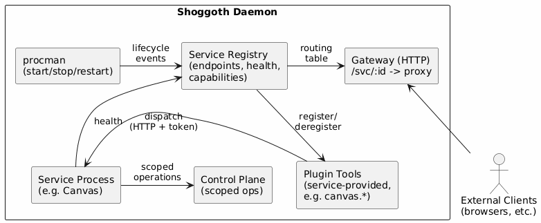

# Web Services Plugin

## Summary

A first-class subsystem for declaring, managing, discovering, and communicating with HTTP/WebSocket services within Shoggoth. Enables agents to expose and consume web-based interfaces (Canvas, dashboards, APIs) through a unified lifecycle managed by procman.

## Motivation

Shoggoth currently has no concept of web services. Procman manages process lifecycles, but there's no layer above it that understands "this process serves HTTP on port X" or "agents should be able to call this service." As we port Canvas Web and anticipate future integrations (dashboards, webhook receivers, agent-facing APIs), we need a standard pattern for:

1. Declaring a web service and its contract (port, routes, protocol)
2. Letting procman manage its lifecycle with service-aware health checks
3. Allowing agents to discover and interact with services via tools
4. Optionally exposing services through a shared HTTP gateway with auth
5. Providing a communication bridge between agents and services (bidirectional)

Without this, each web integration becomes a bespoke wiring job. A plugin spec gives us a repeatable pattern and a clear extension point.

## Design

### Architecture Overview



### Key Components

**1. Service Declaration (config-driven)**

Services come in two flavors:

- **Managed services** — declared in `processes[]` with a `service` block. Procman handles the full lifecycle (start, stop, restart, health monitoring).
- **External services** — declared in a top-level `services[]` block. Shoggoth does not launch or stop these processes, but still performs health checks, auth, tool registration, and gateway routing. Useful for services running in separate containers, on remote hosts, or managed by systemd/Docker/k8s.

Both types go through the same registration, approval, health check, and tool lifecycle. The only difference is who owns the process.

Managed service example:

```jsonc
{
  "processes": [
    {
      "id": "canvas-web",
      "label": "Canvas Web",
      "startPolicy": "boot",
      "command": "node",
      "args": ["dist/server/index.js"],
      "cwd": "/opt/shoggoth-canvas",
      "env": { "PORT": "3100" },
      "restartMode": "on-failure",
      "health": { "kind": "http", "target": "http://localhost:3100/health" },
      "service": {
        "port": 3100,
        "protocol": "http+ws",
        "capabilities": ["canvas", "a2ui"],
        "expose": "gateway",
      },
    },
  ],
}
```

External service example:

```jsonc
{
  "services": [
    {
      "id": "analytics-dashboard",
      "label": "Analytics Dashboard",
      "host": "10.0.1.50",
      "port": 8080,
      "protocol": "http",
      "basePath": "/",
      "capabilities": ["analytics"],
      "expose": "gateway",
      "health": { "kind": "http", "target": "http://10.0.1.50:8080/health" },
    },
  ],
}
```

**2. Service Registry (runtime)**

A singleton that tracks healthy services and their metadata. For managed services, it's populated by procman lifecycle events (process started + health check passed → registered; process stopped → deregistered). For external services, the registry runs its own health check loop and registers/deregisters based on reachability. Provides lookup by ID and by capability.

**3. HTTP Gateway (optional, daemon-managed)**

A lightweight reverse proxy that routes external requests to managed services. Runs as a procman-managed process itself (or an in-process HTTP listener). Provides:

- Path-based routing: `GET /svc/canvas-web/...` → `http://localhost:3100/...`
- Auth enforcement: validates Shoggoth-issued tokens before proxying
- CORS and rate limiting at the edge

The gateway is optional — services can also bind directly to host ports for development or single-service deployments.

**4. Plugin Tool Registration**

Services provide their own tools rather than going through a generic invoke layer. The service plugin spec defines a hook for services to register tools with the daemon at startup:

- Service declares its tools in its manifest (`GET /manifest` → `tools[]`)
- On service registration (healthy), the daemon registers those tools into the builtin tool registry scoped to the service
- On service deregistration (stopped/failed), tools are removed
- Tools are thin proxies: the daemon handles auth token minting and HTTP dispatch; the service defines the tool schema and handles the request

This means Canvas provides `canvas.show`, `canvas.push`, `canvas.eval` etc. as first-class agent tools — not generic HTTP calls wrapped in a `service.invoke` envelope.

**5. Auth & Control Plane Access with Operator Approval**

New services must be registered and approved by the operator via the CLI before they can communicate with the daemon. During registration, a unique key pair is generated and the operator approves the service's requested control plane scope.

Registration flow:

1. Service is declared in config or operator runs `shoggoth service register <id>`
2. Service starts and serves its manifest (including requested `ops[]`)
3. Daemon fetches manifest and creates a pending registration request
4. Operator runs `shoggoth service requests` to see pending service IDs
5. Operator runs `shoggoth service request <id>` to view full details (requested ops, capabilities, manifest info)
6. Operator runs `shoggoth service approve <id>` to approve
7. On approval, daemon generates an age X25519 identity for the service and stores the recipient (public key, `age1...`) in the daemon's credential store
8. The service's identity (private key, `AGE-SECRET-KEY-1...`) is provided to the service **once** at approval time (displayed by CLI, or written to a file the service can read)
9. The daemon encrypts tokens to the service's recipient; only the service can decrypt them using its identity

This means:

- No shared secrets in environment variables
- Each service has its own age identity — compromise of one service doesn't affect others
- Operator must explicitly review and approve each service and its requested scope before it can interact with the daemon
- Key rotation is per-service via `shoggoth service rotate-key <id>`
- Scope changes require re-approval via `shoggoth service approve <id>`

Token claims (encrypted to the service's recipient):

- `sub`: agent ID
- `scope`: service ID
- `iat` / `exp`: issued/expiry timestamps
- `session`: originating session URN (optional, for audit)

When a plugin tool proxies a request to its service, the daemon encrypts a short-lived token to the service's recipient. The service decrypts it using its identity to verify authenticity and extract claims.

**6. Control Plane Access for Services**

Services that need to interact with Shoggoth beyond responding to tool calls (e.g., Canvas invoking agent turns when a user clicks a button) get scoped access to the existing control plane.

- On startup, an approved service connects to the daemon's control plane (Unix socket or localhost endpoint) and authenticates with its age identity
- The daemon enforces the approved operation scope — requests for unapproved operations are rejected
- Services use the same control plane protocol and operations that already exist (turn invocation, session messaging, queries, etc.)
- No new API surface needed — the control plane is the API; registration just gates access to it

This avoids building a parallel service-specific API. The control plane already supports the operations services need; the plugin system just adds authentication and scoped authorization on top.

### Data Flow: Agent Uses a Service Tool

1. Agent calls `canvas.push { surface: "main", nodes: [...] }` (a tool registered by the Canvas service)
2. Tool handler (registered dynamically from manifest) resolves the Canvas service URL from the registry
3. Registry returns `{ url: "http://127.0.0.1:3100", healthy: true }`
4. Tool handler mints a short-lived token encrypted to Canvas's recipient
5. Tool handler dispatches the request to the service with `Authorization: Bearer <token>`
6. Canvas Web decrypts the token using its identity, processes the push, returns response
7. Tool handler returns the result to the agent

### Data Flow: Service Invokes an Agent Turn

1. User clicks a button in the Canvas UI
2. Canvas Web connects to the daemon control plane (already authenticated at startup)
3. Canvas sends `turn.invoke { sessionUrn: "agent:dev:...", message: "User clicked Submit on form X" }`
4. Daemon checks that "turn.invoke" is in Canvas's approved scope
5. Daemon injects the message and triggers an agent turn
6. Agent processes the event, potentially calling `canvas.push` back to update the UI

### Integration with Existing Systems

- **procman** — No changes to procman's core. The service registry listens to procman's `process-started` / `process-stopped` / `process-failed` events and maintains its own state.
- **Config schema** — `ProcessDeclaration` gains an optional `service` field. Backward compatible. New top-level `services[]` for external services.
- **Tool registry** — Service tools are dynamically registered/deregistered based on service health. They coexist with builtin tools.
- **Control plane** — Existing operations are reused. New auth/scope layer gates access for service clients.
- **Shutdown** — Gateway drains connections before procman stops service processes. Registered as a separate drain phase.
- **CLI** — New `shoggoth service` subcommands for registration, approval, scope review, key rotation, and status.

### Service Contract (what services must implement)

A Shoggoth-managed web service must:

1. Listen on the port declared in the `service.port` config field (how the service determines its port is its own concern — env var, config file, hardcoded default, etc.)
2. Expose a health endpoint (path configurable in `health` config)
3. Decrypt `Authorization: Bearer <token>` headers using the age identity provided during operator-approved registration
4. Expose a `GET /manifest` endpoint (path configurable via `service.manifestPath`) if it provides agent tools

The manifest endpoint is required for services that provide agent tools. It enables the daemon to dynamically register and describe tools without hardcoding knowledge of each service.

## Testing Strategy

- **Unit tests** for service registry (register, deregister, lookup by ID, lookup by capability, health state transitions)
- **Unit tests** for token minting and validation
- **Integration tests** for the full flow: procman starts a mock HTTP service → registry picks it up → manifest fetched → tools registered → agent invokes tool → request proxied → response returned
- **Integration tests** for gateway proxying with auth enforcement
- **Integration tests** for tool lifecycle: service goes unhealthy → tools deregistered → service recovers → tools re-registered
- **Manual verification** with Canvas Web as the first real service

## Considerations

- **Port conflicts** — Services declare their ports in config. The registry should detect conflicts at config validation time, not at runtime.
- **Hot reload** — If a service's config changes (port, basePath), the gateway must update its routing table. This ties into Shoggoth's existing config hot-reload mechanism.
- **Multi-tenant isolation** — In a multi-agent deployment, services may need to scope data by agent. The auth token provides identity; the service is responsible for isolation. This plan does not prescribe how services partition data internally.
- **WebSocket lifecycle** — Services that register tools involving long-lived WebSocket connections need cleanup when sessions end. The service registry should notify services of session teardown so they can close associated connections.
- **Gateway vs. direct access** — For development, direct port access is simpler. The gateway adds latency but provides auth and a single entry point. Both modes should be supported; `expose: "gateway" | "direct" | "both"` in config.
- **Control plane scope evolution** — As new control plane operations are added to Shoggoth, services can request access to them by updating their manifest's `ops[]` field. The operator must re-approve the expanded scope via `shoggoth service approve <id>`.
- **Static file serving** — Canvas Web serves a Vue SPA. The gateway could serve static assets directly (bypassing the service process) for performance, but this adds complexity. Deferred to a future optimization pass.

## Migration

No existing data or configuration is affected. The `service` field on `ProcessDeclaration` is optional and additive. Existing `processes[]` entries without a `service` block continue to work unchanged.

## References

- [`spec.md`](spec.md) — type signatures, interfaces, and code examples
- [`implementation.md`](implementation.md) — phased implementation steps
- [procman plan](../done/2026-03-31_process-manager/README.md) — existing process manager design
- [per-agent MCP pool scope](../done/2026-05-04_per-agent-mcp-pool-scope/README.md) — prior art for scoped process identity
